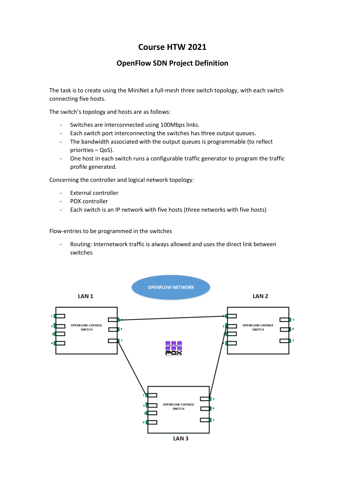
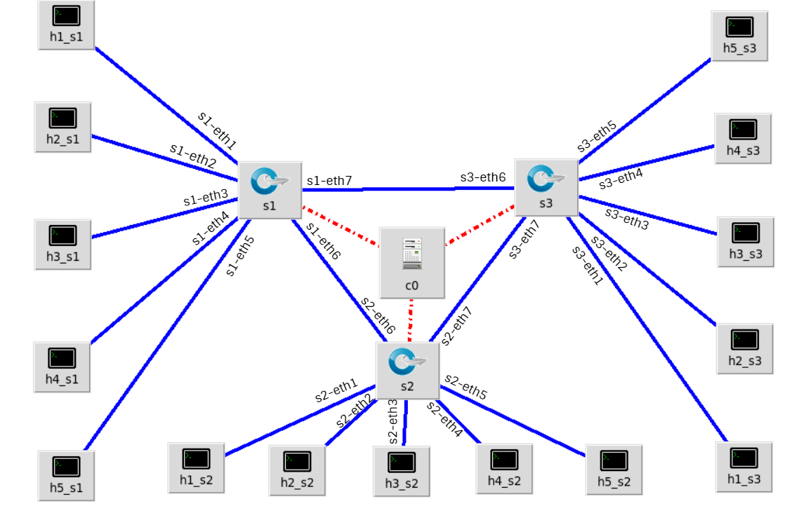

# OpenFlowSDN
Implementation of a full-mesh three switch topology, using a POX controller.

The project requirements are as follows:




First of all, it is necessary to set up the Mininet virtual machine properly.

# Mininet Setup
In the first place, it is necessary to run dhclient, which sets the IP of all interfaces created on the virtual machine.
```
sudo dhclient
```
We can use different PuTTy sessions to connect to the virtual machine. 
________________________________________________________________________________________

# Mininet Topology
The topology implemented is as the following sketch:



## Source code of the topology and its description
In order to execute the topology script and create it on Mininet.
```
sudo python topology.py
```

### 1.Importing libraries
In this section I imported all the **libraries** needed to create the components of the topology above.

```python
from mininet.net import Mininet
from mininet.node import Controller,OVSKernelSwitch
from mininet.link import TCLink
from mininet.cli import CLI
from mininet.log import setLogLevel
from mininet.node import RemoteController
```
### 2.Creating the Mininet instance
Here I created a Mininet class object and as arguments I passed the type of links and switches, respectively.
```python
net = Mininet( link=TCLink, switch=OVSKernelSwitch )
```
### 3.Creating the hosts, switches and controller
The following lines show the creation of the 15 hosts of our topology, assigning each IP address, MAC address and their default route. Each host is named by the switch associated. 
* Host 1 of switch 1: h1_s1
* Host 4 of switch 3: h4_s3

There are 3 LANs, one for each switch:
* **Switch 1** and its hosts: **10.0.0.0/8**
* **Switch 2** and its hosts: **11.0.0.0/8**
* **Switch 3** and its hosts: **12.0.0.0/8**

There is also a pattern concerning the MAC addresses---> The least significant bit of the last byte is the **host number**, and the most significant bit of the last byte is an **enumeration** from 0 to 2. 

This is helpful to identify in a more simple way the corresponding MAC addresses.

Finally, I added the 3 switches to the net and the controller.

I also assigned a port(6633) and an IP address(127.0.0.1) to the remote controller.
```python
h1_s1 = net.addHost( 'h1_s1', ip='10.0.0.1/8',mac='00:00:00:00:00:01',defaultRoute="via 10.0.0.1")
h2_s1 = net.addHost( 'h2_s1', ip='10.0.0.2/8',mac='00:00:00:00:00:02',defaultRoute="via 10.0.0.1")
h3_s1 = net.addHost( 'h3_s1', ip='10.0.0.3/8',mac='00:00:00:00:00:03',defaultRoute="via 10.0.0.1")
h4_s1 = net.addHost( 'h4_s1', ip='10.0.0.4/8',mac='00:00:00:00:00:04',defaultRoute="via 10.0.0.1")
h5_s1 = net.addHost( 'h5_s1', ip='10.0.0.5/8',mac='00:00:00:00:00:05',defaultRoute="via 10.0.0.1")

h1_s2 = net.addHost( 'h1_s2', ip='11.0.0.1/8',mac='00:00:00:00:00:11',defaultRoute="via 11.0.0.1")
h2_s2 = net.addHost( 'h2_s2', ip='11.0.0.2/8',mac='00:00:00:00:00:12',defaultRoute="via 11.0.0.1")
h3_s2 = net.addHost( 'h3_s2', ip='11.0.0.3/8',mac='00:00:00:00:00:13',defaultRoute="via 11.0.0.1")
h4_s2 = net.addHost( 'h4_s2', ip='11.0.0.4/8',mac='00:00:00:00:00:14',defaultRoute="via 11.0.0.1")
h5_s2 = net.addHost( 'h5_s2', ip='11.0.0.5/8',mac='00:00:00:00:00:15',defaultRoute="via 11.0.0.1")

h1_s3 = net.addHost( 'h1_s3', ip='12.0.0.1/8',mac='00:00:00:00:00:21',defaultRoute="via 12.0.0.1")
h2_s3 = net.addHost( 'h2_s3', ip='12.0.0.2/8',mac='00:00:00:00:00:22',defaultRoute="via 12.0.0.1")
h3_s3 = net.addHost( 'h3_s3', ip='12.0.0.3/8',mac='00:00:00:00:00:23',defaultRoute="via 12.0.0.1")
h4_s3 = net.addHost( 'h4_s3', ip='12.0.0.4/8',mac='00:00:00:00:00:24',defaultRoute="via 12.0.0.1")
h5_s3 = net.addHost( 'h5_s3', ip='12.0.0.5/8',mac='00:00:00:00:00:25',defaultRoute="via 12.0.0.1")

s1 = net.addSwitch('s1')
s2 = net.addSwitch('s2')
s3 = net.addSwitch('s3')

c1 = net.addController( 'c1', controller=RemoteController, ip='127.0.0.1', port=6633)
```
### 4.Creating links
The function of these instructions is to set the links among hosts and switches, I also passed the connected ports as an argument, this was necessary to clarify the right paths all over the networks.
```python
net.addLink(h1_s1, s1,port1=1,port2=1)
net.addLink(h2_s1, s1,port1=1,port2=2)
net.addLink(h3_s1, s1,port1=1,port2=3)
net.addLink(h4_s1, s1,port1=1,port2=4)
net.addLink(h5_s1, s1,port1=1,port2=5)

net.addLink(h1_s2, s2,port1=1,port2=1)
net.addLink(h2_s2, s2,port1=1,port2=2)
net.addLink(h3_s2, s2,port1=1,port2=3)
net.addLink(h4_s2, s2,port1=1,port2=4)
net.addLink(h5_s2, s2,port1=1,port2=5)

net.addLink(h1_s3, s3,port1=1,port2=1)
net.addLink(h2_s3, s3,port1=1,port2=2)
net.addLink(h3_s3, s3,port1=1,port2=3)
net.addLink(h4_s3, s3,port1=1,port2=4)
net.addLink(h5_s3, s3,port1=1,port2=5)
```
### 5.Starting the Mininet object and the Mininet CLI(Interface)
Once the **exit** command is sent in the CLI, the net.stop() command will be executed, stopping the simulation.
```python
net.build()
net.start()
CLI( net )
net.stop()
```
### 6.Set some parameters to display information.
The **setLogLevel()** command will display more information about the components of the topology, showing all the components in the CLI, then the main topology function is called and executed.
```python
if __name__ == '__main__':
	setLogLevel( 'info' )
	topology()

```

It is important to run the following command to clean up all the simulation environment so we can start another one without having previous components or information not deleted.
```
sudo mn -c
```
________________________________________________________________________________________
# POX Controller
I coded my own POX controller to fulfill the requirements of the project. 
First of all, the controller must be created in the **pox/ext** directory. 
```
cd pox/ext
```
```
geany controller.py
```

## Source code of the controller and its description
In order to execute the controller, we must be in the **pox** directory.
```
cd pox
```
Then we can execute the controller
```
sudo python ./pox.py controller
```
### 1.Importing libraries
In this section I imported the **libraries** needed to use  OpenFlow commands and instructions.

I also imported other libraries which I used to implement some other processes that will explained.

```python
from pox.core import core
import pox.openflow.libopenflow_01 as of
from pox.openflow.flow_table import *
from pox.lib.util import dpidToStr
import os
```
### Program sequence
### 1. Start listeners 
Once the controller starts, the **launch()** function is executed, adding 2 listeners, the first one waiting for switch connections and the second one waiting for incoming packets.

 ```python
def launch ():
	core.openflow.addListenerByName("ConnectionUp", _handle_ConnectionUp)
	core.openflow.addListenerByName("PacketIn", _handle_PacketIn)
 ```
 
### 2. Switches connection up
Once thethe topology is started, the first function executed is the one below:**handleConnectionUp(event)**.

The function waits for the switches to get started, when they start, the controller will print "Connection up: switch Datapath ID", establishing a connection between the switches and the controller. 

It also assigns to the variables **s1_dpid, s2_dpid and s3_dpid** the real DPID of the switches in order to work with it later.

 ```python
s1_dpid = 0
s2_dpid = 0
s3_dpid = 0

def _handle_ConnectionUp(event):
	
		global s1_dpid, s2_dpid, s3_dpid
		print("ConnectionUp: ", dpidToStr(event.connection.dpid))
		
		add_queues("s1-eth7")
		add_queues("s1-eth6")
		add_queues("s2-eth7")
		add_queues("s2-eth6")
		add_queues("s3-eth7")
		add_queues("s3-eth6")

		for m in event.connection.features.ports:
			if m.name == "s1-eth1":
				s1_dpid = event.connection.dpid
			elif m.name == "s2-eth1":
				s2_dpid = event.connection.dpid
			elif m.name == "s3-eth1":
				s3_dpid = event.connection.dpid
            
```
Futhermore, I have also included in this function the creation of the output queues, so they are created and set before all the process. I pass the switch port as an argument and then since there is no option with OpenFlow 1.0 version to create queues, I used the OS module to run the command from the controller.

Concerning the output queues:
* First of all, I set the link among switches as max. 100MBps links---> **other-config:max-rate=100000000**
* The first queue, uses a bandwith of 1 MBit --->**create queue other-config:min-rate=1000000 other-config:max-rate=1000000**
* The second queue, uses a bandwith of 2 MBit --->**create queue other-config:min-rate=2000000 other-config:max-rate=2000000**
* The third queue, uses a bandwith of 3 MBit --->**create queue other-config:min-rate=3000000 other-config:max-rate=3000000**

Finally, I run this command using **os.system(command)**
```python
def add_queues(port):
	command = 'ovs-vsctl set port '+port+' qos=@newqos -- \
--id=@newqos create QoS type=linux-htb  \
 other-config:max-rate=100000000 \
 queues:1=@1\
 queues:2=@2 \
 queues:3=@3 -- \
--id=@1 create queue other-config:min-rate=1000000 other-config:max-rate=1000000 -- \
--id=@2 create queue other-config:min-rate=2000000 other-config:max-rate=2000000 -- \
--id=@3 create queue other-config:min-rate=3000000 other-config:max-rate=3000000 > /dev/null'
	os.system(command)

```
### 3. Reception of a packet
After the switches are properly connected to the controller, the next step is to wait until a **packet** arrives to any of the switches. 

I get the packet data by using **event.parsed** and I also assign the global type to switch Datapath IDs variables so I can access them from these function.

There are 3 IF conditions:
* First one: **if event.connection.dpid==s1_dpid:** ---> If the packet arrives to switch1
* First one: **if event.connection.dpid==s1_dpid:** ---> If the packet arrives to switch2
* First one: **if event.connection.dpid==s1_dpid:** ---> If the packet arrives to switch3

The content is the same in the 3 conditions. 
* First, we set the type of operation, in this case **ofp_flow_mod()**, this is used to set flow entries in the flow tables of the switches. Then I set the **hard timeout** as 30 sec. In the next line, i specify the protocol code, in this case 0x0806 **ARP** and then the flow will be set in the switch using the instruction **(of.ofp_action_output(port = of.OFPP_ALL))**, finally with **event.connection.send(msg)** the flow is sent to the switch. This is necessary to get the reachability through all the 3 networks.
* Then, I call a function called **add_ sameNetworkFlows(event, ip)**. Explanation below this code.
* After setting all the flows inside the networks, it is time to set them between different LANs. I call twice the function add_flows, for instance for the S1 condition, the first call is to set the flows between S1 network (10.0.0.0) and the S2 network (11.0.0.0), and the second one is to set the flows between S1 network and S3 network. I also pass a third argument responsible to set the destination MAC addresses properly. Explanation below.

```python
def _handle_PacketIn (event):
	packet = event.parsed
	global s1_dpid, s2_dpid, s3_dpid
	
	if event.connection.dpid==s1_dpid:
		msg = of.ofp_flow_mod()
		msg.hard_timeout = 30
		msg.match.dl_type = 0x0806
		msg.actions.append(of.ofp_action_output(port = of.OFPP_ALL))
		event.connection.send(msg)
		
		add_sameNetworkFlows(event,"10.0.0.")
		
		add_flows(event,"10.0.0.","11.0.0.",1)
		add_flows(event,"10.0.0.","12.0.0.",2)
		
				
					
	elif event.connection.dpid==s2_dpid:
		msg = of.ofp_flow_mod()
		msg.hard_timeout = 30
		msg.match.dl_type = 0x0806
		msg.actions.append(of.ofp_action_output(port = of.OFPP_ALL))
		event.connection.send(msg)	
		
		add_sameNetworkFlows(event,"11.0.0.")
		
		add_flows(event,"11.0.0.","10.0.0.",0)
		add_flows(event,"11.0.0.","12.0.0.",2)
		
		
		
	elif event.connection.dpid==s3_dpid:
		msg = of.ofp_flow_mod()
		msg.hard_timeout = 30
		msg.match.dl_type = 0x0806
		msg.actions.append(of.ofp_action_output(port = of.OFPP_ALL))
		event.connection.send(msg)
		
		add_sameNetworkFlows(event,"12.0.0.")
		
		add_flows(event,"12.0.0.","10.0.0.",0)
		add_flows(event,"12.0.0.","11.0.0.",1)
```
#### add_sameNetworkFlows(ev,ipdst):
This functions has 2 arguments, the first one the event and the second one the destination IP, what I do here is to **set the flows** in the respective switch in order to reach **the hosts** of the **same switch** or network. Since the switch port number matches the last byte of the IP destination, I used a for loop, specified the hard timeout and the IP code:0x0800.

Example:
* add_sameNetworkFlows(event,"10.0.0.")--> This is the root address of the switch1, called from the switch1 condition.
* from 1 to 5 , I set the **myipdst** variable as a string concatenation between  the root address(10.0.0.) and the i number,don´t forget to assign it to the msg IP destination **msg.match.nw_dst** so it would fill the 5 IPs, 10.0.0.1 to the port 1, 10.0.0.2 to the port 2 ..... 10.0.0.5 to the port 5.
* Finnally, the flow is installed in the switch with **ev.connection.send(msg)** 

```python
def add_sameNetworkFlows(ev,ipdst):
	for i in range(1,6):
			msg = of.ofp_flow_mod()
			msg.hard_timeout = 30
			msg.match.dl_type = 0x0800
			myipdst=ipdst+str(i)
			msg.match.nw_dst = myipdst
			msg.actions.append(of.ofp_action_output(port = i))
			ev.connection.send(msg)
```
#### add_Flows(ev,ipsrc,ipdst,n):
The functionailty of this block is to decide which port has to be set to reach another switch network. For instance if we want to add the flow rules to communicate from the LAN 10.0.0.0 to the LAN 11.0.0.0, the chosen port will be the s1-eth6, as this is the one connecting S1 and S2, and so on with all the LANs.

```python
def add_flows(ev,ipsrc,ipdst,n):
inport=0
	if   ipsrc=="10.0.0." and ipdst=="11.0.0.":
		inport=6
	elif ipsrc=="10.0.0." and ipdst=="12.0.0.":
		inport=7
	elif ipsrc=="11.0.0." and ipdst=="10.0.0.":
		inport=6
	elif ipsrc=="11.0.0." and ipdst=="12.0.0.":
		inport=7
	elif ipsrc=="12.0.0." and ipdst=="10.0.0.":
		inport=6
	elif ipsrc=="12.0.0." and ipdst=="11.0.0.":
		inport=7
```

Here I am using a for loop very similar to the one in the **add_sameNetworkFlows(ev,ipdst)** function. 
* First difference: I am using the loop index and the "n" parameter to assign the IPs an the MAC addresses. If you remember the topology, the most significative bit of the last byte of S1 hosts start by **0**, for s2 by **1**, for s3 by **2**, e.g:
    * h1_s1--->"00:00:00:00:00:**0**1"
    * h1_s2--->"00:00:00:00:00:**1**1"
    * h5_s3--->"00:00:00:00:00:**2**5"
  
* Then I assign the IP bit exactly like in the function **add_sameNetworkFlows(ev,ipdst)**, h1_s1 ---> j=1, h4_s2 --->j=4 ...
* **msg.actions.append(of.ofp_action_dl_addr.set_dst(EthAddr("00:00:00:00:00:"+str(n)+str(j))))** ---> I modify the destination MAC address in order to **be able to communicate among 3 LANs**, e.g, ipdst:11.0.0.3. Every time that a packet arrives having 11.0.0.3 as a destination IP, the MAC address destination will be **modified** by the one which is inside the function **set_dst**, in this case it would be "EthAddr("00:00:00:00:00:13)". This was the key for allowing me to implement correctly the 3 LANs requirement.
* Second difference: Here I do not use **of.ofp_action_output(port)**, instead I use **ofp_action_enqueue(port,queue_id)** in order to assign the rule to the 3 different output queues which I created previously.
    * If the destination host is the **host1** or **host2** ---> All the packets destined to h1 or h2 will go through the port chosen previously and through the **queue** id **1**.(1Mbit)
    * If the destination host is the **host3** or **host4** ---> All the packets destined to h3 or h4 will go through the port chosen previously and through the **queue** id **2**.(2Mbit)
    * If the destination host is the **host5** ---> All the packets destined to h5 will go through the port chosen previously and through the **queue** id **3**.(3Mbit)

```python
	for j in range(1,6):
		msg = of.ofp_flow_mod()
		msg.match.dl_type = 0x0800
		myipdst=ipdst + str(j)
		msg.match.nw_dst = myipdst
		msg.actions.append(of.ofp_action_dl_addr.set_dst(EthAddr("00:00:00:00:00:"+str(n)+str(j))))
		
		if str(myipdst).rsplit('.',1)[1]=="1" or str(myipdst).rsplit('.',1)[1]=="2":
			msg.actions.append(of.ofp_action_enqueue(port = inport,queue_id=1))
		elif str(myipdst).rsplit('.',1)[1]=="3" or str(myipdst).rsplit('.',1)[1]=="4":
			msg.actions.append(of.ofp_action_enqueue(port = inport,queue_id=2))
		elif str(myipdst).rsplit('.',1)[1]=="5":
			msg.actions.append(of.ofp_action_enqueue(port = inport,queue_id=3))
			
		ev.connection.send(msg)
```
			
