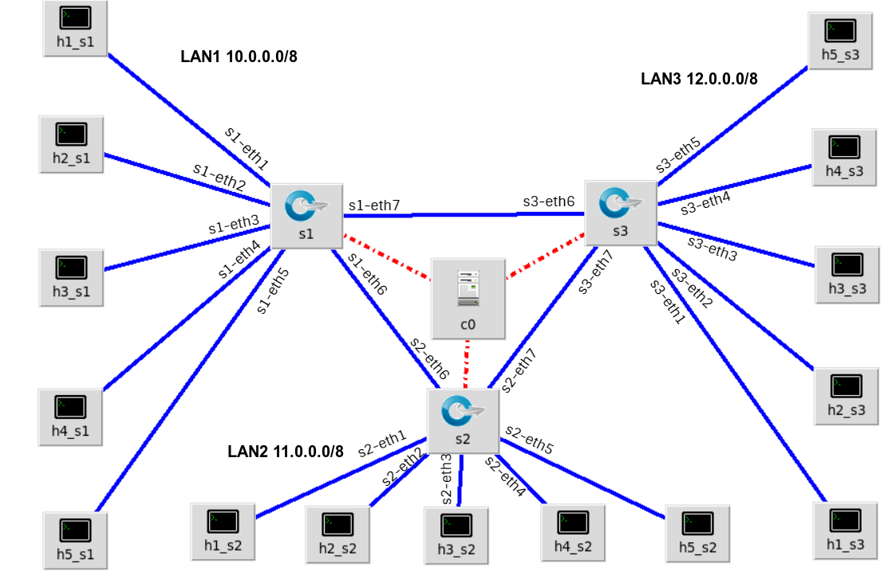

# OpenFlowSDN
Implementation of a full-mesh three switch topology, using a POX controller.

The project requirements are as follows:


First of all, it is necessary to set up the Mininet virtual machine properly.

# Mininet Setup
In the first place, it is necessary to run dhclient, which sets the IP of all interfaces created on the virtual machine.
```
sudo dhclient
```
We can use different PuTTy sessions to connect to the virtual machine. 

# Mininet Topology
The topology implemented is as the following sketch:



________________________________________________________________________________________


